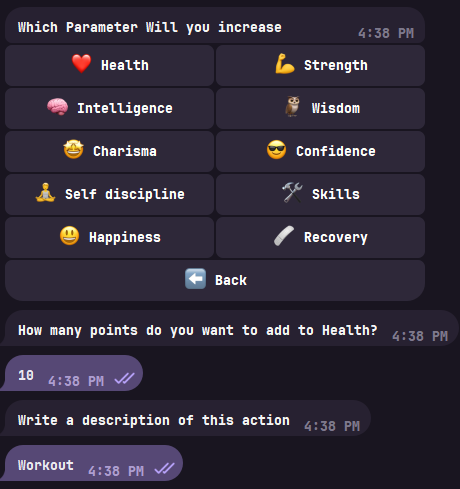
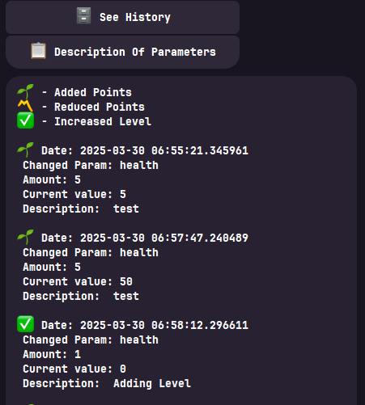

# RPG Life Parameter System

This is a guide to gamifying your life, using RPG-style mechanics to track your personal growth, progress, and well-being.  
The concept involves tracking key attributes such as **Health**, **Strength**, **Intelligence**, and more — each representing a specific aspect of your real-life journey.  

You gain **experience points (XP)** by completing tasks, challenges, and daily quests.  
As you earn XP, your **level increases**, reflecting your progress and evolution across all tracked parameters.  
This system makes your daily activities more engaging and rewarding, turning personal growth into a game-like adventure.  

> 🧠 This project is implemented in **Python** using the **Aiogram** framework for Telegram bots.  
> The bot allows you to interact with your character, update stats, and view your progress directly in chat.

---

## Parameters List:
1. [Health (HP)](#health-hp)
2. [Strength (STR)](#strength-str)
3. [Intelligence (INT)](#intelligence-int)
4. [Charisma (CHA)](#charisma-cha)
5. [Self-Discipline (SD)](#self-discipline-sd)
6. [Confidence (CON)](#confidence-con)
7. [Happiness (HAP)](#happiness-hap)
8. [Recovery (REC)](#recovery-rec)
9. [Skills (SKL)](#skills-skl)
10. [Wisdom (WIS)](#wisdom-wis)

---

## 🧩 Project Overview & Examples

Below are examples from my **Telegram bot**, which uses this system in real-time conversations.  
You can interact with your “character,” complete daily tasks, gain XP, and level up through the bot’s interface.  
As your XP increases, your **parameters grow**, and your **level rises**, representing your personal development.

| Description | Image |
|--------------|--------|
| 📊 Parameter Overview |  |
| 💪 Increasing Parameters |  |
| 🧠 Progress History |  |

These examples demonstrate how the RPG life system can be visualized and interacted with inside Telegram — turning everyday habits into a gamified experience.

---

## Character Parameters

 
## **1. Health (HP)**

**Meaning**:  
Health represents your physical and emotional well-being. It serves as a gauge of your overall state, both in terms of your body and mind. If your health is high, you're feeling energetic, resilient, and ready to take on challenges. If it's low, you may be sluggish, fatigued, or susceptible to burnout.

**How it increases**:  
- **Exercise**: Engaging in physical activity like workouts, yoga, stretching, or sports will boost your health, increasing both your stamina and overall well-being. (+10 HP for regular exercise, +5 HP for daily walks or minor activities)  
- **Good Nutrition**: Eating balanced meals and staying hydrated contributes to a healthy body and mind. (+5 HP for healthy meals or snacks, +5 HP for water intake)  
- **Rest and Recovery**: Getting adequate sleep and allowing time for recovery after intense physical or mental exertion helps replenish your health. (+15 HP for a full night of rest)  
- **Mental Wellness Practices**: Activities like meditation, mindfulness, or journaling promote emotional well-being and prevent stress buildup. (+10 HP for 10 minutes of meditation, +5 HP for self-care routines)  

**How it decreases**:  
- **Illness**: When you're sick or run down, your health decreases. Physical sickness, injury, or emotional distress will sap your energy and leave you vulnerable. (-20 HP for illness, -10 HP for physical injury, -5 HP for mental burnout)  
- **Poor Habits**: Skipping workouts, eating poorly, or neglecting sleep negatively impact your health. (-5 HP for missed exercise, -5 HP for unhealthy eating, -10 HP for inadequate sleep)  
- **Stress and Negativity**: Emotional stress, negativity, or burnout can lower your health, as it affects your overall resilience and energy levels. (-5 HP for negative self-talk, -10 HP for unresolved stress)

**Other Notes**:
- **Critical Health**: If your HP drops too low, you might find it hard to complete your daily quests or take on new challenges. You may need to prioritize recovery and healing during this time.
- **Healing Items**: Special activities or habits can act as "healing potions" to restore your HP. For example, taking a day off to focus on self-care, going for a walk in nature, or having a healthy comfort meal can help regenerate your health.
- **Health Potions**: You can consider things like supplements, vitamins, or even a "mental health day" as ways to restore HP more quickly.

Remember, **Health** is not just about physical vitality but also about emotional and mental resilience. It’s important to balance all aspects to maintain optimal HP and ensure you can take on the challenges ahead.

## **2. Strength (STR)** 

**Description**:  
  Strength (STR) represents your physical power, muscle endurance, and overall ability to perform strenuous activities. It is the foundation of your physical capabilities and is closely tied to your ability to handle physical challenges. STR affects everything from how much you can lift, the intensity of your workouts, and your stamina in physically demanding situations.

**How it increases**:  
  To increase your Strength, you must engage in physical activities that challenge and develop your muscles. This includes activities such as:
  - **Strength training**: Lifting weights, resistance training, bodyweight exercises (e.g., push-ups, squats).
  - **Cardio workouts with strength elements**: High-intensity interval training (HIIT), circuit training, or activities like rock climbing.
  - **Functional movements**: Daily activities that engage your muscles in real-world applications (e.g., carrying groceries, climbing stairs).
  - **Consistent effort**: Gradually increasing the intensity of your workouts over time.
  
  Your strength will grow as you break down muscle fibers during training and allow them to rebuild stronger during recovery periods. Adequate protein intake, proper rest, and progressive overload are key components for muscle growth.

**How it decreases**:  
  Your Strength can decrease when you neglect physical activity or if you experience periods of inactivity. Common factors that can lower your Strength include:
  - **Sedentary lifestyle**: Lack of regular exercise or movement.
  - **Injury or illness**: When you're unable to engage in physical activities due to physical setbacks.
  - **Overtraining**: Excessive exercise without proper recovery can lead to muscle fatigue and decrease overall strength.
  - **Poor nutrition**: Insufficient calorie or protein intake, which hinders muscle repair and growth.

**Additional Notes**:
  - **Recovery and Rest**: Strength gains are not just about how much you train but how well you recover. Overworking your muscles without adequate rest can lead to injury and burnout, so recovery time is essential.
  - **Progressive Overload**: To build strength, you need to progressively challenge your muscles. This means increasing the weight, intensity, or volume of exercises over time.
  - **Mind-Muscle Connection**: Being mindful during workouts and focusing on muscle engagement can also enhance the effectiveness of strength training.

## **3. Intelligence (INT)** 

- **Description**:  
  Intelligence (INT) represents your cognitive abilities, learning capacity, problem-solving skills, and knowledge. It's about how well you can absorb new information, think critically, and apply your knowledge to solve challenges. This parameter affects your ability to understand complex concepts, process new data, and innovate.

- **How it increases**:  
  - **Reading and Learning**: Engaging with books, articles, research, or educational videos expands your knowledge.  
  - **Studying**: Actively studying and mastering new subjects, be it formal education or self-learning, increases your intelligence.  
  - **Problem-Solving**: Solving puzzles, mathematical challenges, or critical-thinking exercises sharpens your mind and boosts INT.  
  - **Creative Thinking**: Exploring creative outlets, such as writing, brainstorming, or generating new ideas, promotes cognitive development.  
  - **Continuous Education**: Participating in courses, seminars, and other learning opportunities contributes to intellectual growth.

- **How it decreases**:  
  - **Lack of Mental Stimulation**: If you stop challenging your mind and learning, your intelligence can stagnate.  
  - **Stress and Fatigue**: Chronic stress and lack of rest can negatively impact cognitive function and intellectual performance.  
  - **Poor Lifestyle Choices**: Inadequate nutrition, sleep, and exercise can impair brain function and decrease intelligence.

- **Additional Notes**:  
  - **Mindfulness and Reflection**: Taking the time to reflect on and apply what you've learned enhances your cognitive abilities.  
  - **Curiosity**: Cultivating curiosity and a thirst for knowledge promotes lifelong intellectual growth.  
  - **Engage in Discussions**: Talking to others about various topics encourages new perspectives and can enhance your intelligence.

## 4. Charisma (CHA) 

- **Description**:  
  Charisma (CHA) represents your social influence, communication skills, and ability to connect with others. It’s about how well you can inspire, persuade, and lead. A high Charisma score means that you can easily engage with people, motivate them, and leave a lasting impression.

- **How it increases**:  
  To increase Charisma, you need to focus on improving your social and emotional intelligence. This includes:
  - **Public Speaking**: Engaging in public speaking or storytelling to improve your confidence and communication skills.
  - **Active Listening**: Paying full attention to others and responding thoughtfully can strengthen your interpersonal connections.
  - **Empathy**: Understanding and responding to the emotions of others helps build strong, trust-based relationships.
  - **Networking**: Actively seeking out opportunities to meet new people and build meaningful relationships.
  - **Positive Body Language**: Using open, confident, and friendly body language can increase your attractiveness and presence.
  - **Leadership**: Taking on roles where you inspire or guide others, such as in team projects or community efforts, can boost Charisma.

- **How it decreases**:  
  Charisma can decrease if you neglect your social interactions or if you lose focus on building meaningful relationships. This can happen if:
  - **Social Isolation**: Spending too much time alone or avoiding social situations can lower your Charisma.
  - **Poor Communication**: Failing to connect with others due to ineffective communication or lack of empathy can impact your Charisma.
  - **Negative Behavior**: Displaying arrogance, disinterest, or negative body language can damage your social presence and lower your Charisma.

- **Additional Notes**:  
  - **Self-Awareness**: Being aware of your own emotions and how they affect others can help you control and improve your Charisma.
  - **Practice**: Like any skill, Charisma improves with practice. Engage in social activities, take on leadership roles, and continually refine your people skills.
  - **Authenticity**: Genuine confidence and authenticity are key. People are drawn to those who are real and sincere in their interactions.

## 5. Self-Discipline (SD) 

- **Description**:  
  Self-Discipline (SD) represents your ability to control your impulses, stay focused on long-term goals, and resist distractions or temptations that could derail your progress. It’s the mental toughness and commitment to doing what needs to be done, even when it’s challenging or not immediately rewarding.

- **How it increases**:  
  To increase Self-Discipline, you need to practice self-control and consistently follow through on commitments. Here are some ways to improve it:
  - **Setting Clear Goals**: Define specific, measurable, and achievable goals that motivate you to stay focused.
  - **Creating and Following a Routine**: Build healthy habits by sticking to a daily routine that supports your goals and ensures you remain on track.
  - **Time Management**: Use techniques like the Pomodoro Technique or time blocking to avoid procrastination and keep your focus sharp.
  - **Avoiding Temptations**: Recognize your personal distractions and actively work to avoid or eliminate them (e.g., putting your phone away during work or study sessions).
  - **Building Willpower**: Take on small challenges that test your willpower, such as skipping dessert or waking up early, and gradually build your ability to resist immediate gratification.
  - **Positive Reinforcement**: Reward yourself for staying disciplined and achieving milestones to reinforce the behavior.

- **How it decreases**:  
  Self-Discipline can decrease if you fail to stay consistent with your goals or give in to temptations too often. This can happen if:
  - **Procrastination**: Regularly putting off tasks or responsibilities leads to a lack of follow-through and weakens self-discipline.
  - **Lack of Focus**: Constant distractions, multitasking, or jumping between tasks can lower your ability to stay disciplined and focused.
  - **Burnout**: Overworking or pushing yourself too hard without rest can lead to a loss of motivation and weakened self-discipline.
  - **Giving In to Instant Gratification**: Allowing yourself to give in to short-term pleasures without considering long-term goals can erode self-discipline.

- **Additional Notes**:  
  - **Mindfulness**: Practicing mindfulness and being aware of your thoughts can help you stay disciplined by identifying when you're tempted to stray from your goals.
  - **Accountability**: Having an accountability partner or public commitment can help you stay on track with your self-discipline efforts.
  - **Patience**: Building strong self-discipline is a gradual process. Be patient with yourself as you develop this skill, and don’t get discouraged by setbacks.

### 6. **Confidence (CON)** 
- **Description**:  
  Confidence represents your belief in your abilities and judgment. It’s the inner strength that allows you to face challenges with assurance and trust in your skills.

- **How it increases**:  
  - Success and Achievement: Accomplishing goals boosts confidence.
  - Positive Self-Talk: Challenging negative thoughts and replacing them with affirmations increases your belief in yourself.
  - Preparation and Practice: The more you prepare, the more confident you'll feel.
  - Stepping Outside Your Comfort Zone: Facing fears builds confidence.

- **How it decreases**:  
  - Failure Without Reflection: When you don’t learn from failure, it reduces confidence.
  - Self-Doubt: Constantly questioning your worth lowers confidence.
  - Lack of Validation: Not receiving validation or support from others weakens confidence.

- **Additional Notes**:  
  Confidence can be built through experience and a positive mindset. Cultivating self-belief takes time and practice.

---

### 7. **Happiness (HAP)** 
- **Description**:  
  Happiness represents your emotional state and overall life satisfaction. It reflects how content and fulfilled you feel in different aspects of life.

- **How it increases**:  
  - Positive Relationships: Engaging with loved ones boosts happiness.
  - Gratitude: Regularly practicing gratitude increases happiness.
  - Pursuing Passions: Engaging in hobbies brings joy.
  - Acts of Kindness: Helping others boosts happiness.

- **How it decreases**:  
  - Stress: Chronic stress negatively impacts happiness.
  - Social Isolation: Lack of social interaction can lower happiness.
  - Unresolved Negative Emotions: Holding onto grudges reduces happiness.

- **Additional Notes**:  
  Happiness is a blend of internal and external factors. Practices like mindfulness and self-care are key to lasting happiness.

---

### 8. **Recovery (REC)** 
- **Description**:  
  Recovery is your ability to recuperate, physically and mentally, from stress, fatigue, or injury. It measures how well you recharge and restore balance.

- **How it increases**:  
  - Rest and Sleep: Quality sleep supports recovery.
  - Relaxation: Reducing stress through activities like yoga or meditation aids recovery.
  - Nutrition: Eating nourishing foods helps the body recover.
  - Social Support: Emotional recovery is enhanced by positive social connections.

- **How it decreases**:  
  - Overworking: Pushing yourself too hard without recovery leads to burnout.
  - Chronic Stress: Lack of relaxation hampers recovery.
  - Neglecting Self-Care: Skipping rest and recovery routines weakens overall health.

- **Additional Notes**:  
  Regular recovery practices improve overall performance and prevent burnout.

---

### 9. **Skills (SKL)** 
- **Description**:  
  Skills represent your ability to perform tasks efficiently. This includes both hard and soft skills, such as technical expertise and interpersonal abilities.

- **How it increases**:  
  - Practice: Regular practice helps refine skills.
  - Learning: Studying new topics builds skills.
  - Seeking Feedback: Improving through feedback helps you develop better skills.
  - Mentorship: Learning from experts accelerates skill growth.

- **How it decreases**:  
  - Lack of Practice: Not practicing skills leads to deterioration.
  - Complacency: Failing to challenge yourself leads to stagnation.
  - Burnout: Overworking and stress hinder skill development.

- **Additional Notes**:  
  Consistent learning and practicing are essential for building strong skills.

---

### 10. **Wisdom (WIS)** 
- **Description**:  
  Wisdom reflects your ability to make sound decisions based on experience, knowledge, and good judgment.

- **How it increases**:  
  - Life Experience: Learning from mistakes and successes builds wisdom.
  - Mindfulness: Reflecting on your thoughts and actions enhances wisdom.
  - Seeking Advice: Gaining perspectives from others expands your wisdom.
  - Self-Reflection: Regular reflection helps apply experiences to future situations.

- **How it decreases**:  
  - Ignoring Lessons: Not learning from mistakes reduces wisdom.
  - Closed-Mindedness: Rejecting new ideas stunts wisdom.
  - Emotional Reactivity: Acting impulsively without thinking reduces wisdom.

- **Additional Notes**:  
  Wisdom grows over time as you learn and adapt from experiences.

---